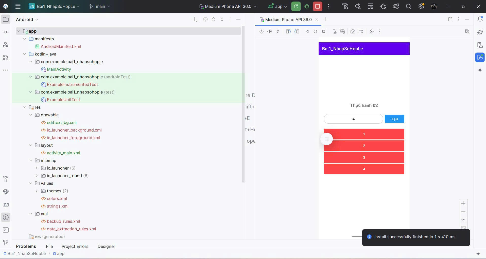
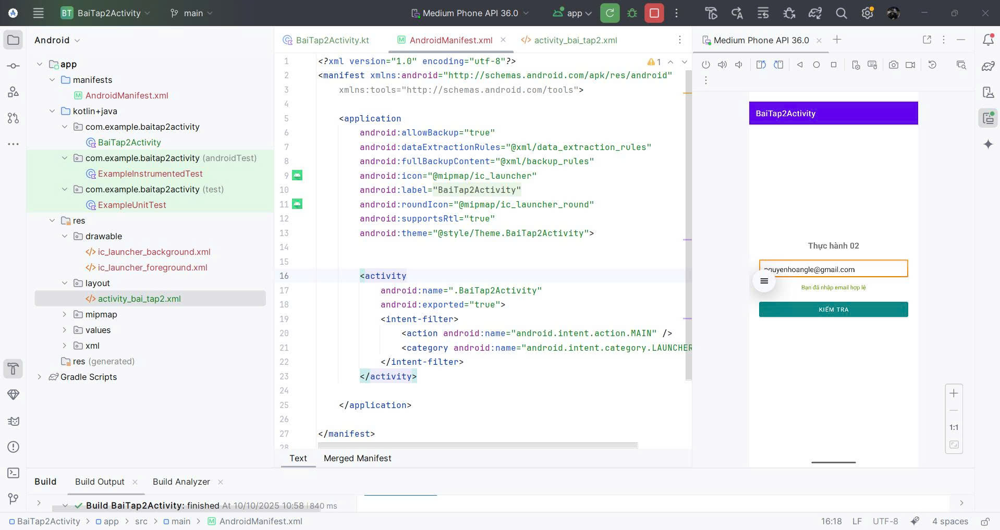
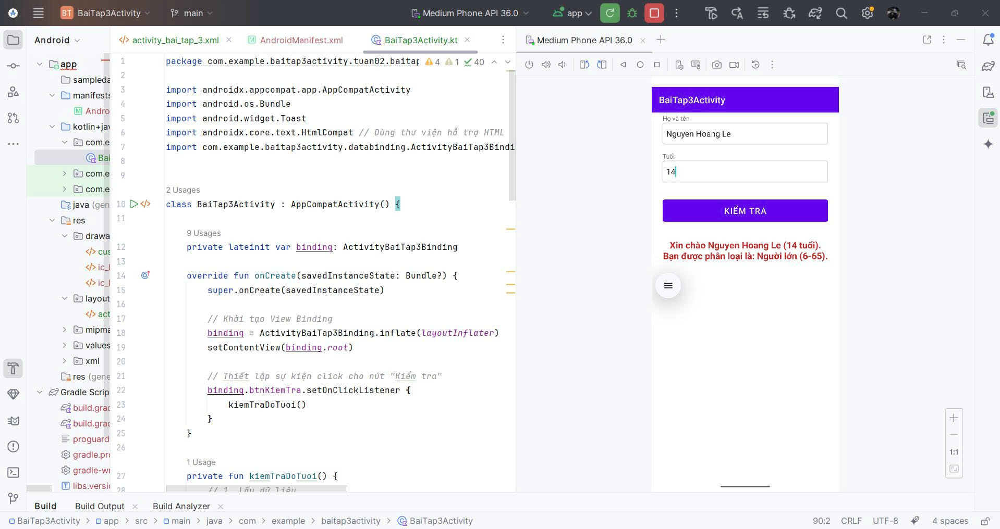

# 📂 Source Code Tuần 2

## 🎯 Mục tiêu
- Làm quen với **Android Layout** (LinearLayout) và xử lý logic với Kotlin.
- Thực hiện validation (xác thực) dữ liệu nhập vào (số điện thoại, email).
- Tính toán và phân loại nhóm tuổi dựa trên năm sinh.
- Hiển thị thông báo lỗi và kết quả trên giao diện.

## 📌 Các file chính
- `BaiTap01_ValidationSDT/app/src/main/java/com/example/baitap01_validationsdt/MainActivity.kt`: Logic validation số điện thoại.
- `BaiTap01_ValidationSDT/app/src/main/res/layout/activity_main.xml`: Layout cho bài tập 1.
- `BaiTap02_ValidationEmail/app/src/main/java/com/example/baitap02_validationemail/MainActivity.kt`: Logic validation email.
- `BaiTap02_ValidationEmail/app/src/main/res/layout/activity_main.xml`: Layout cho bài tập 2.
- `BaiTap03_PhanLoaiTuoi/app/src/main/java/com/example/baitap03_phanloaituoi/MainActivity.kt`: Logic phân loại tuổi.
- `BaiTap03_PhanLoaiTuoi/app/src/main/res/layout/activity_main.xml`: Layout cho bài tập 3.

## 🔎 Giải thích các thành phần
- `<EditText android:id="@+id/etSoDienThoai" ... />` (Bài 1): Ô nhập số điện thoại.
- `<Button android:id="@+id/btnKiemTra" ... />` (Bài 1, 2, 3): Nút kiểm tra dữ liệu.
- `<TextView android:id="@+id/tvLoi" ... />` (Bài 1, 2): Hiển thị thông báo lỗi.
- `<EditText android:id="@+id/etEmail" ... />` (Bài 2): Ô nhập email.
- `<EditText android:id="@+id/etHoTen" ... />` (Bài 3): Ô nhập họ tên.
- `<EditText android:id="@+id/etNamSinh" ... />` (Bài 3): Ô nhập năm sinh.
- `<TextView android:id="@+id/tvKetQua" ... />` (Bài 3): Hiển thị nhóm tuổi.
- `<Button android:id="@+id/btnOption1" ... />` (Bài 1): Nút ví dụ dữ liệu (tùy chọn).

## 🎨 Giao diện
Các ứng dụng gồm:
- Ô nhập liệu (EditText) cho số điện thoại, email, hoặc họ tên và năm sinh.
- Nút "Tạo" hoặc "Kiểm tra" để thực hiện validation/phân loại.
- Thông báo lỗi (TextView màu đỏ) khi dữ liệu không hợp lệ.
- Kết quả phân loại tuổi (Bài 3) hiển thị trên TextView.
- Bốn nút ví dụ (Bài 1) với màu đỏ để điền dữ liệu mẫu.

## 📸 Kết quả
- 
- 
- 