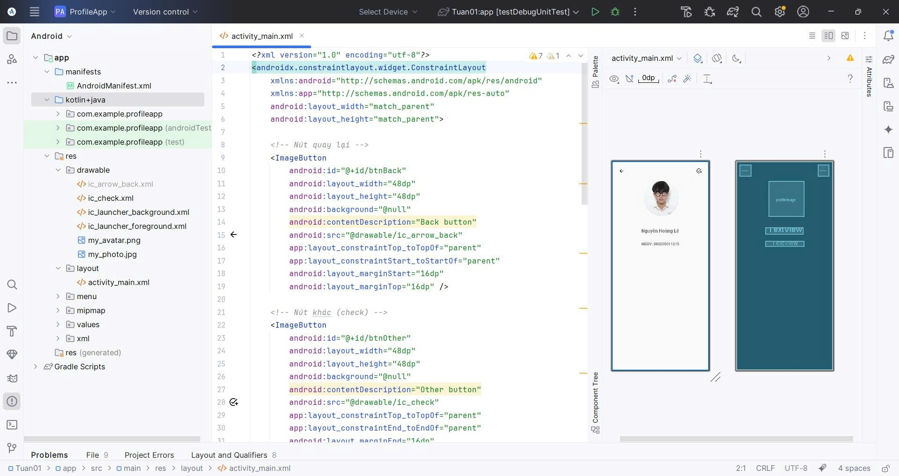

# 📂 Source Code Tuần 1

## 🎯 Yêu cầu 1. Trả lời câu hỏi: 
- Mong muốn và định hướng của bạn là gì sau khi học xong môn học? 
+Cải thiện khả năng lập trình
+Viết được nhiều ứng dụng thiết bị di động hơn
+Có khả năng đi thực tập sớm
+Biết cách viết CV chuyên nghiệp
- Trong 10 năm tới, lập trình di động có còn phát triển không? Tại sao?
Theo em thì trong 10 năm tới lập trình di động chắc chắn vẫn phát triển. Bởi vì điện thoại thông minh ngày càng phổ biến và gắn liền với cuộc sống hằng ngày, nhu cầu dùng app để học tập, làm việc, giải trí hay thanh toán sẽ còn nhiều hơn nữa. Thêm vào đó, các công nghệ mới như AI, IoT hay AR/VR sẽ làm ứng dụng di động ngày càng thông minh và đa dạng, nên cơ hội cho lập trình di động vẫn rất lớn.

## 🎯 Mục tiêu
- Làm quen với **Android Layout** và thư viện `ConstraintLayout`.
- Hiển thị ảnh đại diện, tên sinh viên, MSSV và các nút chức năng.

## 📌 Các file chính
- `activity_main.xml`: Layout giao diện chính.
- `MainActivity.java`: Xử lý logic hiển thị.
- `ic_arrow_back.xml`, `ic_check.xml`: Icon nút back và check.
- `my_avatar.png`: Ảnh đại diện sinh viên.

## 🔎 Giải thích các thành phần
- `<ImageButton android:id="@+id/btnBack" ... />` → Nút quay lại.
- `<ImageButton android:id="@+id/btnOther" ... />` → Nút xác nhận (check).
- `<de.hdodenhof.circleimageview.CircleImageView ... />` → Avatar hình tròn.
- `<TextView android:id="@+id/studentName" ... />` → Hiển thị tên sinh viên.
- `<TextView android:id="@+id/studentId" ... />` → Hiển thị MSSV.

## 🎨 Giao diện
Ứng dụng gồm:
- Ảnh đại diện hình tròn.
- Họ tên sinh viên.
- Mã số sinh viên.
- Nút back (mũi tên trái) và nút check (xác nhận).

## 📸 Kết quả
